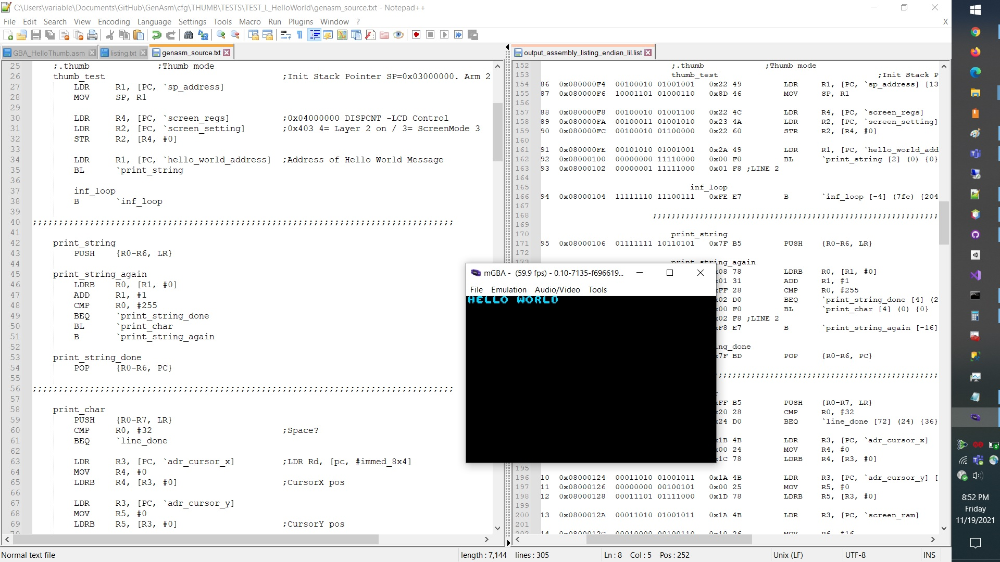
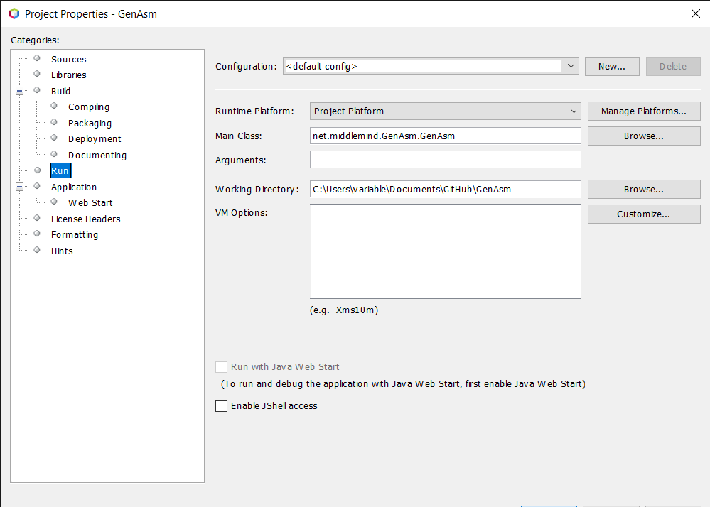

# GenAsm: Intro

An extensible assembler project with an ARM Thumb-1 instruction set example implementation.
This project is meant as a learning tool to help people understand how to write an assembler. 
The assembler uses multiple scans to simplify the amount of work done in each scan. It also generates a 
number of output files so that the state of the assembler can be analyzed at different points in the assembly process.
I wrote this project for my brother, Carlo.

# Example Output Showing GameBoy Advance Hello World
The assembler can build binaries the the GameBoy Advance can run. Many of the test programs are designed to run on the emulator.  

# IDE Setup
In order to run the GenAsm project directly from the IDE using the hardcoded test program values you need to configure the project's settings and specify the working directory as the root of the project as shown in the following image.

# Directory Setup

If you're running the GenAsm assembler outside of the NetBeans project the directory structure should look like this:

<pre>
-> Assembler Install Directory  
   -> GenAsm.jar  
   -> cfg  
      -> is_sets.json  
      -> THUMB  
         -> /* instruction set data files here */  
         -> OUTPUT  
            -> TEST_N_AsmChecks 
               -> /* assembler output files should go here */
         -> TESTS  
            -> TEST_N_AsmChecks  
               -> genasm_source.txt 
</pre>

# Symbol/Label Reference Types Supported
Using different characters you can reference a symbol and extract different values in the process.

<pre>
-Label Reference Address =: Used to return the address of the label referenced. 
-Label Reference Value ~: Used to return the value, if available, of the label referenced. 
-Label Reference Offset Address -: Used to return the offset to the address of the label referenced taking into account the pre-fetch offset. 
-Label Reference Offset Address Less Prefetch `: Used to return the offset to the address of the label referenced ignoring the pre-fetch offset. 
</pre>

# Example Command Line Execution

The arguments have been listed on individual lines for readability.
The paths shown here are only relevant to my development environment.
You have to adjust the paths shown here or those hardcoded in the GenAsm.java class.

<pre>
java -jar GenAsm.jar   
 "./cfg/is_sets.json"   
 "THUMB_ARM7TDMI"   
 "net.middlemind.GenAsm.Loaders.LoaderIsSets"  
 "net.middlemind.GenAsm.JsonObjs.JsonObjIsSets"  
 "net.middlemind.GenAsm.Assemblers.Thumb.AssemblerThumb"  
 "C:\Users\variable\Documents\GitHub\GenAsm\cfg\THUMB\TESTS\TEST_N_AsmChecks\genasm_source.txt"  
 "net.middlemind.GenAsm.Linkers.Thumb.LinkerThumb"  
 "net.middlemind.GenAsm.PreProcessors.Thumb.PreProcessorThumb"  
 "C:\Users\variable\Documents\GitHub\GenAsm\cfg\THUMB\OUTPUT\TEST_N_AsmChecks\"  
 "false"  
 "false"  
 "C:\Users\variable\Documents\GitHub\GenAsm\cfg\" 
</pre> 
 
# Conversion of Command Line Arguments to Class Fields

<pre>
CFG_DIR_PATH = args[11];  
ASM_SETS_FILE_NAME = args[0];  
ASM_TARGET_SET = args[1];  
ASM_SETS_LOADER_CLASS = args[2];  
ASM_SETS_TARGET_CLASS = args[3];  
ASM_SETS = null;  
ASM_SET = null;  
ASM_ASSEMBLER_CLASS = args[4];  
ASM_ASSEMBLER = null;  
ASM_ASSEMBLY_SOURCE_FILE = args[5];  
ASM_LINKER_CLASS = args[6];  
ASM_LINKER = null;  
ASM_PREPROCESSOR_CLASS = args[7];  
ASM_PREPROCESSOR = null;  
ASM_ROOT_OUTPUT_DIR = args[8];  
ASM_VERBOSE = Boolean.parseBoolean(args[9]);  
ASM_QUELL_FILE_OUTPUT = Boolean.parseBoolean(args[10]); 
</pre>

# Example of Hardcoded Arguments

An example of using hardcoded arguments directly in the static main during development to speed up iterations.
The paths shown here are only relevant to my development environment.
You have to adjust the paths shown here or those hardcoded in the GenAsm.java class.

<pre>
String targetProgram = "TEST_N_AsmChecks"; 
CFG_DIR_PATH = "C:\\Users\\variable\\Documents\\GitHub\\GenAsm\\cfg\\"; 
ASM_SETS_FILE_NAME = "./cfg/is_sets.json"; 
ASM_TARGET_SET = "THUMB_ARM7TDMI"; 
ASM_SETS_LOADER_CLASS = "net.middlemind.GenAsm.Loaders.LoaderIsSets"; 
ASM_SETS_TARGET_CLASS = "net.middlemind.GenAsm.JsonObjs.JsonObjIsSets"; 
ASM_SETS = null; 
ASM_SET = null; 
ASM_ASSEMBLER_CLASS = "net.middlemind.GenAsm.Assemblers.Thumb.AssemblerThumb"; 
ASM_ASSEMBLER = null; 
ASM_ASSEMBLY_SOURCE_FILE = CFG_DIR_PATH + "THUMB\\TESTS\\" + targetProgram + "\\genasm_source.txt"; 
ASM_LINKER_CLASS = "net.middlemind.GenAsm.Linkers.Thumb.LinkerThumb"; 
ASM_LINKER = null; 
ASM_PREPROCESSOR_CLASS = "net.middlemind.GenAsm.PreProcessors.Thumb.PreProcessorThumb"; 
ASM_PREPROCESSOR = null; 
ASM_ROOT_OUTPUT_DIR = CFG_DIR_PATH + "THUMB\\OUTPUT\\" + targetProgram + "\\"; 
ASM_VERBOSE = false; 
ASM_QUELL_FILE_OUTPUT = false;
</pre>

# Description of Output Files

## In Process: Output Generated

<pre>
output_pre_processed_assembly.txt: Output after preprocessor runs.
output_lexed.json: Output after the lexer runs.
output_tokened_phase0_tokenized.json: Output after phase0 runs, tokenizer results.
output_tokened_phase1_valid_lines.json: Output after phase1 runs, opcode valid lines.
output_tokened_phase2_refactored.json: Output after phase2 runs, refactoring groups, lists, comments.
output_tokened_phase3_valid_lines.json: Output after phase3 runs, directive valid lines.
output_tokened_phase4_bin_output.json: Output after phase4, ready for generating binary output.
</pre>

## Building Binary Files: Output Generated

<pre>
output_symbols.json: A listing of the symbols found during the assembly process.
output_area_desc_code.json: A listing of area descriptions.
output_area_lines_code.json: A listing of area associated lines.
output_linked_area_lines_code.json: A listing of linked area lines of source code.
output_assembly_listing_endian_big.list: Big endian listing.
output_assembly_listing_endian_lil.list: Little endian listing.
output_assembly_listing_endian_big.bin: Big endian binary output.
output_assembly_listing_endian_lil.bin: Little endian binary output.
</pre>

# Supported Preprocessor Directives

<pre>
Include Binary File: $INCBIN, $FLPINCBIN 
Include Assembly File: $INCASM 
Non-Operation: $NOP 
Include String Data: $STRING, $FLIPSTRING 
</pre>

# Supported Directives

<pre>
@DCHW: A data directive used to write two bytes of data at the current memory location. 
@FLPDCHW: A data directive used to write two bytes of data, with flipped endianness, at the current memory location. 
@DCWBF: A data directive used to write the first byte of a two-byte value as a halfword, at the current memory location. 
@DCWBS: A data directive used to write the second byte of a two-byte value as a halfword, at the current memory location. 
@DCB: A data directive used to write one byte of data as a halfword at the current memory location. 
@EQU: A label directive used to set a label to a specific value, creating a label value entry that can be referenced by subsequent assembly instructions. 
@ORG: A memory directive used to set the starting memory address to be used in all listing and memory address calculations. 
@TTL: An area definition directive used to define a program’s title. 
@SUBT: A program definition directive used to define a program’s subtitle. 
@ENTRY: An area definition directive used to define the start of an area. 
@END: An area definition directive used to define the end of an area. 
@AREA: An area definition directive used to indicate the start of an area definition. 
@READONLY: An area definition directive used to indicate if the area is read-only. Not currently in use. 
@READWRITE: An area definition directive used to indicate if the area is read-write. Not currently in use.  
@CODE: An area definition directive used to indicate if the area is a code area and not a data area. 
@DATA: An area definition directive used to indicate if the area is a data area and not a code area.
</pre>

# Instruction Set File Registration

You can define an instruction set by adding entries to the is_sets.json data file. An example of the file is as follows.

<pre>
File: is_sets.json
Description: Holds the definition of an instruction set through the description of associated data files.
Example:
{
    "obj_name": "is_sets",
    "is_sets": [
        {
            "obj_name": "is_set",
            "set_name": "THUMB_ARM7TDMI",
            "is_files": [
                {
                    "obj_name": "is_file",
                    "path": "./cfg/THUMB/is_arg_types.json",
                    "loader_class": "net.middlemind.GenAsm.Loaders.Thumb.LoaderIsArgTypes",
                    "target_class": "net.middlemind.GenAsm.JsonObjs.Thumb.JsonObjIsArgTypes",
                    "category": "arguments"
                }
               ...
</pre>

# Thumb Instruction Set Data Files

A description of the data files used to define, drive the ARM Thumb-1 instruction set implementation. You can define your own files, 
preprocessor, lexer, tokener, assmebler, and linker to implement a new instruction set or you can build off of what's available in the project.

<pre>
File: is_arg_types.json
Description: Holds a definition of all the Thumb-1 instruction set's argument types.
Example:
{
    "obj_name": "is_arg_types",  
    "set_name": "THUMB_ARM7TDMI",
    "is_arg_types": [
        {
            "obj_name": "is_arg_type",
            "arg_name": "Group",
            "is_entry_types": ["GroupStart", "GroupStop"]
        }
        ...
</pre>

<pre>
File: is_directives.json
Description: Holds a definition of all the Thumb-1 instruction set's supported directives.
Example:
{
    "obj_name": "is_directives",
    "set_name": "THUMB_ARM7TDMI",
    "is_directives": [
        {
            "obj_name": "is_directive",
            "directive_name": "@DCB",
            "arg_len": 1,
            "args": [
                {
                    "obj_name": "is_directive_arg",
                    "arg_index": 0,
                    "bit_index": 0,
                    "is_entry_types": ["Number", "LabelRef"],
                    "is_arg_type": "Number",
                    "bit_series": {
                        "bit_start": 0,
                        "bit_stop": 15,
                        "bit_len": 16
                    },
                    "num_range": {
                        "min_value": 0,
                        "max_value": 255,
                        "bit_len": 8,
                        "twos_compliment": false,
                        "alignment": "HALFWORD"
                    },
                    "bit_shift": {
                        "shift_dir": "NONE",
                        "shift_amount": -1
                    }
                }                
            ],
            "description": "The DCB directive is used to write data, one byte written as a halfword, directly into the data AREA of an assembly file."
        }
        ...
</pre>

<pre>
File: is_empty_data_lines.json
Description: Holds a JSON definition of an empty line of assembly used when process a 2-line branch instruction.
Example:
See the associated file.
</pre>

<pre>
File: is_entry_types.json
Description: Holds a definition of all the Thumb-1 instruction set's entry types.
Example:
{
    "obj_name": "is_entry_types",  
    "set_name": "THUMB_ARM7TDMI",
    "is_entry_types": [
        {
            "obj_name": "is_entry_type",
            "type_name": "Comment",
            "type_category": "Comment",
            "category": "Comment",
            "category_class": "java.lang.String",
            "txt_match": {
                "starts_with": [";"],
                "contains": ["*"],
                "must_contain": [],
                "must_not_contain": [],
                "ends_with": ["*"]
            }
        }
        ...
</pre>

<pre>
File: is_op_codes.json
Description: Holds a definition of all the Thumb-1 instruction set's opcodes.
Example:
{
    "obj_name": "is_op_codes",
    "set_name": "THUMB_ARM7TDMI",
    "endian": "BIG",
    "pc_prefetch_bits": 32,
    "pc_prefetch_bytes": 4,
    "pc_prefetch_halfwords": 2,    
    "pc_prefetch_words": 1,
    "pc_alignment": "WORD",
    "pc_lsb_zeroed": true,
    "nop_assembly": "MOV R8, R8 ;nop instruction",
    "nop_binary": "0100011011000000",
    "nop_hex": "46C0",
    "bit_series": {
        "bit_start": 0,
        "bit_stop": 15,
        "bit_len": 16
    },
    "is_op_codes": [
        {
            "obj_name": "is_op_code",
            "op_code_name": "LSL",
            "index": 0,
            "arg_len": 3,
            "arg_separator": ",",
            "bit_rep": {
                "bit_string": "00000",
                "bit_int": 0,
                "bit_len": 5
            },
            "bit_series": {
                "bit_start": 11,
                "bit_stop": 15,
                "bit_len": 5
            },
            "args": [
                {
                    "obj_name": "is_op_code_arg",
                    "arg_index": 0,
                    "bit_index": 0,
                    "is_entry_types": ["RegisterLow"],
                    "is_arg_type": "Rd",
                    "bit_series": {
                        "bit_start": 0,
                        "bit_stop": 2,
                        "bit_len": 3
                    }
                },
                {
                    "obj_name": "is_op_code_arg",            
                    "arg_index": 1,
                    "bit_index": 1,
                    "is_entry_types": ["RegisterLow"],
                    "is_arg_type": "Rs",
                    "bit_series": {
                        "bit_start": 3,
                        "bit_stop": 5,
                        "bit_len": 3
                    }
                },
                {
                    "obj_name": "is_op_code_arg",  
                    "arg_index": 2,
                    "bit_index": 2,
                    "is_entry_types": ["Number", "LabelRef"],                    
                    "is_arg_type": "Offset5",
                    "bit_series": {
                        "bit_start": 6,
                        "bit_stop": 10,
                        "bit_len": 5
                    },
                    "num_range": {
                        "min_value": 0,
                        "max_value": 31,
                        "bit_len": 5,
                        "twos_compliment": false,
                        "alignment": "NATURAL"
                    },
                    "bit_shift": {
                        "shift_dir": "NONE",
                        "shift_amount": 0
                    }
                }
            ]
        }
        ...
</pre>

<pre>
File: is_registers.json
Description: Holds a definition of all the Thumb-1 instruction set's registers.
Example:
{
    "obj_name": "is_registers",
    "set_name": "THUMB_ARM7TDMI",
    "is_registers": [
        {
            "register_name": "R0",
            "obj_name": "is_register",
            "is_entry_type": "RegisterLow",
            "bit_rep": {
                "bit_string": "000",
                "bit_int": 0,
                "bit_len": 3
            },
            "type": "LOW",
            "desc": "general purpose"
        }
        ...
</pre>

<pre>
File: is_valid_lines.json
Description: Holds a definition of all the Thumb-1 instruction set's valid lines.
Example:
{
    "obj_name": "is_valid_lines",
    "set_name": "THUMB_ARM7TDMI",
    "min_line_entries": 1,
    "max_line_entries": 4,
    "is_valid_lines": [
        {
            "obj_name": "is_valid_line",
            "index": 0,
            "empty_line": true,
            "is_valid_line": [
                {
                    "obj_name": "is_valid_line_entry",
                    "is_entry_types": ["Comment"],
                    "index": 0
                }
            ]
        }
        ...
</pre>

# Example ARM Thumb-1 Assembly Program

An example of a simple ARM Thumb-1 instruction set program. Source code shows the syntax of a number of opcodes. This is test program N of the included test programs.
The assebler only support simple linking of two areas, CODE and DATA. You can still do a fair amount with this simple implementation.

<pre>
@TTL |AssemblerChecks|
@SUBT |SubTitleTest|
@AREA |Program| @CODE, @READONLY
@ENTRY

    test        @EQU    2
    overOne
                BGT     =overOne
                ;$NOP

    ;++++++++++++++++++++++++++++++++
    ;$INCASM |.\cfg\THUMB\INCBIN\test_asm_incasm.txt|
    ;++++++++++++++++++++++++++++++++

    label_                              ;branch label
                LSL     R0, R1, #0      ;5.1
                LSL     R0, R1, #31
                LSR     R0, R1, #0
                LSR     R0, R1, #31
                ASR     R0, R1, #0
                ASR     R0, R1, #31
                ADD     R0, R1, R2      ;5.2
                ADD     R0, R1, #7
                SUB     R0, R1, R2
                SUB     R0, R1, #7
                MOV     R0, #0          ;5.3
                MOV     R0, #255
                CMP     R0, #0
                CMP     R0, #255
                ADD     R0, #0
                ADD     R0, #255
                SUB     R0, #0
                SUB     R0, #255
                AND     R0, R1          ;5.4
                EOR     R0, R1
                LSL     R0, R1
                LSR     R0, R1
                ASR     R0, R1
                ADC     R0, R1
                SBC     R0, R1
                ROR     R0, R1
                TST     R0, R1
                NEG     R0, R1
                CMP     R0, R1
                CMN     R0, R1
                ORR     R0, R1
                MUL     R0, R1
                BIC     R0, R1
                MVN     R0, R1
                ADD     R0, R8          ;5.5
                ADD     R8, R0
                ADD     R8, R9
                CMP     R0, R8
                CMP     R8, R0
                CMP     R8, R9
                MOV     R0, R8
                MOV     R8, R0
                MOV     R8, R9
                BX      R0
                BX      R8
                LDR     R0, [PC, #0]    ;5.6
                LDR     R0, [PC, #1020]
                STR     R0, [R1, R2]    ;5.7
                STRB    R0, [R1, R2]
                LDR     R0, [R1, R2]
                LDRB    R0, [R1, R2]
                STRH    R0, [R1, R2]    ;5.8
                LDRH    R0, [R1, R2]
                LDSB    R0, [R1, R2]
                LDSH    R0, [R1, R2]
                STR     R0, [R1, #0]    ;5.9
                STR     R0, [R1, #124]
                LDR     R0, [R1, #0]
                LDR     R0, [R1, #124]
                STRB    R0, [R1, #0]
                STRB    R0, [R1, #31]
                LDRB    R0, [R1, #0]
                LDRB    R0, [R1, #31]
                STRH    R0, [R1, #0]    ;5.10
                STRH    R0, [R1, #62]
                LDRH    R0, [R1, #0]
                LDRH    R0, [R1, #62]
                STR     R0, [SP, #0]    ;5.11
                STR     R0, [SP, #1020]
                LDR     R0, [SP, #0]
                LDR     R0, [SP, #1020]
                ADD     R0, PC, #0      ;5.12
                ADD     R0, PC, #1020
                ADD     R0, SP, #0
                ADD     R0, SP, #1020
                ADD     SP, #0          ;5.13
                ADD     SP, #508
                ADD     SP, #-508
                PUSH    {R0, R1}        ;5.14
                PUSH    {R0, R1, LR}
                POP     {R0, R1}
                POP     {R0, R1, PC}
                STMIA   R0!, {R1, R2}   ;5.15
                LDMIA   R0!, {R1, R2}
                BEQ     =label_         ;5.16
                BNE     =label_
                BCS     =label_
                BCC     =label_
                BMI     =label_
                BPL     =label_
                BVS     =label_
                BVC     =label_
                BHI     =label_
                BLS     =label_
                BGE     =label_
                BLT     =label_
                BGT     =label_
                BLE     =label_
                SWI     #0              ;5.17
                SWI     #255
                B       =label_         ;5.18
                B       =over
                BL      =label_         ;5.19
                BL      =over
                CMP     R0, #45         ;Other 
                BGT     =over
                B       =locate
                LSR     R2, R5, #27
                ADD     R0, R3, R4
                SUB     R6, R2, #6
                MOV     R0, #127
                CMP     R2, #62
                ADD     R1, #127
                SUB     R6, #1
                EOR     R3, R4
                ROR     R1, R0
                NEG     R5, R3
                CMP     R2, R6
                MUL     R0, R7
                EOR     R3, R4
                ROR     R1, R0
                NEG     R5, R3
                CMP     R2, R6
                MUL     R0, R7
                ADD     PC, R5
                CMP     R4, R12
                MOV     PC, R14
                LDR     R3, [PC, #844]
                STR     R3, [R2, R6]
                LDRB    R2, [R0, R7]
                STRH    R4, [R3, R0]
                LDSB    R2, [R7, R1]
                LDSH    R3, [R4, R2]
                LDR     R2, [R5, #116]
                STRB    R1, [R0, #13]
                STRH    R6, [R1, #56]
                LDRH    R4, [R7, #4]
                ADD     R2, PC, #572
                ADD     R6, SP, #212
                ADD     SP, #68
                ADD     SP, #104
                PUSH    {R0-R4, LR}
                POP     {R2, R6, PC}
                STMIA   R0!, {R3, R4, R5, R6, R7}
    over        CMP     R0, #45
    here        B       =here
    locate      LDR     R2, [R2, R6]

    var1        @DCHW   256
    var2        @DCHW   255
    var3        @DCHW   254
                @DCB    5
                @DCWBS  0x01AC
                @DCWBF  0x01AC
@END

@AREA |Data| @DATA, @READWRITE
@ENTRY

    var4        @DCHW   256
    var5        @DCHW   255
    var6        @DCHW   254

    ;++++++++++++++++++++++++++++++++
    ;$INCBIN |.\cfg\THUMB\INCBIN\ninlogo.dat|
    ;++++++++++++++++++++++++++++++++

    ;++++++++++++++++++++++++++++++++
    ;$FLPINCBIN |.\cfg\THUMB\INCBIN\ninlogo.dat|
    ;++++++++++++++++++++++++++++++++

    ;++++++++++++++++++++++++++++++++
    ;$STRING |Hello World!|
    ;++++++++++++++++++++++++++++++++

    ;++++++++++++++++++++++++++++++++
    ;$FLIPSTRING |Hello World!|
    ;++++++++++++++++++++++++++++++++

@END
</pre>

# Example Listing Output

<pre>
0000000000	0000000000	   	    	                	@TTL |AssemblerChecks|
0000000001	0000000000	   	    	                	@SUBT |SubTitleTest|
0000000002	0000000000	   	    	                	@AREA |Program| @CODE, @READONLY
0000000003	0000000000	   	    	                	@ENTRY
0000000004	0000000000	   	    	                	
0000000005	0000000000	   	    	                	    test        @EQU    2
0000000006	0000000000	   	    	                	    overOne
0000000007	0000000000	0000000000	0x00000000	00000000 11011100	0x00 DC	                BGT     =overOne; [0] (0) {0}
0000000008	0000000002	0000000001	0x00000002	11000000 01000110	0xC0 46	                MOV	R8, R8		;NOP preprocessor directive
0000000009	0000000000	   	    	                	
0000000010	0000000000	   	    	                	    ;++++++++++++++++++++++++++++++++
0000000011	0000000000	   	    	                	    ;$INCASM |.\cfg\THUMB\INCBIN\test_asm_incasm.txt|
0000000012	0000000000	   	    	                	    ;Found file with line count: 4, byte count: 86
0000000013	0000000000	   	    	                	    
0000000014	0000000004	0000000002	0x00000004	11010011 01001011	0xD3 4B	    LDR     R3, [PC, #844]
0000000015	0000000006	0000000003	0x00000006	10010011 01010001	0x93 51	    STR     R3, [R2, R6]
0000000016	0000000008	0000000004	0x00000008	11000010 01011101	0xC2 5D	    LDRB    R2, [R0, R7]
0000000017	0000000010	0000000005	0x0000000A	00011100 01010010	0x1C 52	    STRH    R4, [R3, R0]
0000000018	0000000000	   	    	                	    
0000000019	0000000000	   	    	                	    ;++++++++++++++++++++++++++++++++
0000000020	0000000000	   	    	                	
0000000021	0000000000	   	    	                	    label_                              ;branch label
0000000022	0000000012	0000000006	0x0000000C	00001000 00000000	0x08 00	                LSL     R0, R1, #0      ;5.1
0000000023	0000000014	0000000007	0x0000000E	11001000 00000111	0xC8 07	                LSL     R0, R1, #31
0000000024	0000000016	0000000008	0x00000010	00001000 00001000	0x08 08	                LSR     R0, R1, #0
0000000025	0000000018	0000000009	0x00000012	11001000 00001111	0xC8 0F	                LSR     R0, R1, #31
0000000026	0000000020	0000000010	0x00000014	00001000 00010000	0x08 10	                ASR     R0, R1, #0
0000000027	0000000022	0000000011	0x00000016	11001000 00010111	0xC8 17	                ASR     R0, R1, #31
0000000028	0000000024	0000000012	0x00000018	10001000 00011000	0x88 18	                ADD     R0, R1, R2      ;5.2
0000000029	0000000026	0000000013	0x0000001A	11001000 00011101	0xC8 1D	                ADD     R0, R1, #7
0000000030	0000000028	0000000014	0x0000001C	10001000 00011010	0x88 1A	                SUB     R0, R1, R2
0000000031	0000000030	0000000015	0x0000001E	11001000 00011111	0xC8 1F	                SUB     R0, R1, #7
0000000032	0000000032	0000000016	0x00000020	00000000 00100000	0x00 20	                MOV     R0, #0          ;5.3
0000000033	0000000034	0000000017	0x00000022	11111111 00100000	0xFF 20	                MOV     R0, #255
0000000034	0000000036	0000000018	0x00000024	00000000 00101000	0x00 28	                CMP     R0, #0
0000000035	0000000038	0000000019	0x00000026	11111111 00101000	0xFF 28	                CMP     R0, #255
0000000036	0000000040	0000000020	0x00000028	00000000 00110000	0x00 30	                ADD     R0, #0
0000000037	0000000042	0000000021	0x0000002A	11111111 00110000	0xFF 30	                ADD     R0, #255
0000000038	0000000044	0000000022	0x0000002C	00000000 00111000	0x00 38	                SUB     R0, #0
0000000039	0000000046	0000000023	0x0000002E	11111111 00111000	0xFF 38	                SUB     R0, #255
0000000040	0000000048	0000000024	0x00000030	00001000 01000000	0x08 40	                AND     R0, R1          ;5.4
0000000041	0000000050	0000000025	0x00000032	01001000 01000000	0x48 40	                EOR     R0, R1
0000000042	0000000052	0000000026	0x00000034	10001000 01000000	0x88 40	                LSL     R0, R1
0000000043	0000000054	0000000027	0x00000036	11001000 01000000	0xC8 40	                LSR     R0, R1
0000000044	0000000056	0000000028	0x00000038	00001000 01000001	0x08 41	                ASR     R0, R1
0000000045	0000000058	0000000029	0x0000003A	01001000 01000001	0x48 41	                ADC     R0, R1
0000000046	0000000060	0000000030	0x0000003C	10001000 01000001	0x88 41	                SBC     R0, R1
0000000047	0000000062	0000000031	0x0000003E	11001000 01000001	0xC8 41	                ROR     R0, R1
0000000048	0000000064	0000000032	0x00000040	00001000 01000010	0x08 42	                TST     R0, R1
0000000049	0000000066	0000000033	0x00000042	01001000 01000010	0x48 42	                NEG     R0, R1
0000000050	0000000068	0000000034	0x00000044	10001000 01000010	0x88 42	                CMP     R0, R1
0000000051	0000000070	0000000035	0x00000046	11001000 01000010	0xC8 42	                CMN     R0, R1
0000000052	0000000072	0000000036	0x00000048	00001000 01000011	0x08 43	                ORR     R0, R1
0000000053	0000000074	0000000037	0x0000004A	01001000 01000011	0x48 43	                MUL     R0, R1
0000000054	0000000076	0000000038	0x0000004C	10001000 01000011	0x88 43	                BIC     R0, R1
0000000055	0000000078	0000000039	0x0000004E	11001000 01000011	0xC8 43	                MVN     R0, R1
0000000056	0000000080	0000000040	0x00000050	01000000 01000100	0x40 44	                ADD     R0, R8          ;5.5
0000000057	0000000082	0000000041	0x00000052	10000000 01000100	0x80 44	                ADD     R8, R0
0000000058	0000000084	0000000042	0x00000054	11001000 01000100	0xC8 44	                ADD     R8, R9
0000000059	0000000086	0000000043	0x00000056	01000000 01000101	0x40 45	                CMP     R0, R8
0000000060	0000000088	0000000044	0x00000058	10000000 01000101	0x80 45	                CMP     R8, R0
0000000061	0000000090	0000000045	0x0000005A	11001000 01000101	0xC8 45	                CMP     R8, R9
0000000062	0000000092	0000000046	0x0000005C	01000000 01000110	0x40 46	                MOV     R0, R8
0000000063	0000000094	0000000047	0x0000005E	10000000 01000110	0x80 46	                MOV     R8, R0
0000000064	0000000096	0000000048	0x00000060	11001000 01000110	0xC8 46	                MOV     R8, R9
0000000065	0000000098	0000000049	0x00000062	00000000 01000111	0x00 47	                BX      R0
0000000066	0000000100	0000000050	0x00000064	01000000 01000111	0x40 47	                BX      R8
0000000067	0000000102	0000000051	0x00000066	00000000 01001000	0x00 48	                LDR     R0, [PC, #0]    ;5.6
0000000068	0000000104	0000000052	0x00000068	11111111 01001000	0xFF 48	                LDR     R0, [PC, #1020]
0000000069	0000000106	0000000053	0x0000006A	10001000 01010000	0x88 50	                STR     R0, [R1, R2]    ;5.7
0000000070	0000000108	0000000054	0x0000006C	10001000 01010100	0x88 54	                STRB    R0, [R1, R2]
0000000071	0000000110	0000000055	0x0000006E	10001000 01011000	0x88 58	                LDR     R0, [R1, R2]
0000000072	0000000112	0000000056	0x00000070	10001000 01011100	0x88 5C	                LDRB    R0, [R1, R2]
0000000073	0000000114	0000000057	0x00000072	10001000 01010010	0x88 52	                STRH    R0, [R1, R2]    ;5.8
0000000074	0000000116	0000000058	0x00000074	10001000 01011010	0x88 5A	                LDRH    R0, [R1, R2]
0000000075	0000000118	0000000059	0x00000076	10001000 01010110	0x88 56	                LDSB    R0, [R1, R2]
0000000076	0000000120	0000000060	0x00000078	10001000 01011110	0x88 5E	                LDSH    R0, [R1, R2]
0000000077	0000000122	0000000061	0x0000007A	00001000 01100000	0x08 60	                STR     R0, [R1, #0]    ;5.9
0000000078	0000000124	0000000062	0x0000007C	11001000 01100111	0xC8 67	                STR     R0, [R1, #124]
0000000079	0000000126	0000000063	0x0000007E	00001000 01101000	0x08 68	                LDR     R0, [R1, #0]
0000000080	0000000128	0000000064	0x00000080	11001000 01101111	0xC8 6F	                LDR     R0, [R1, #124]
0000000081	0000000130	0000000065	0x00000082	00001000 01110000	0x08 70	                STRB    R0, [R1, #0]
0000000082	0000000132	0000000066	0x00000084	11001000 01110111	0xC8 77	                STRB    R0, [R1, #31]
0000000083	0000000134	0000000067	0x00000086	00001000 01111000	0x08 78	                LDRB    R0, [R1, #0]
0000000084	0000000136	0000000068	0x00000088	11001000 01111111	0xC8 7F	                LDRB    R0, [R1, #31]
0000000085	0000000138	0000000069	0x0000008A	00001000 10000000	0x08 80	                STRH    R0, [R1, #0]    ;5.10
0000000086	0000000140	0000000070	0x0000008C	11001000 10000111	0xC8 87	                STRH    R0, [R1, #62]
0000000087	0000000142	0000000071	0x0000008E	00001000 10001000	0x08 88	                LDRH    R0, [R1, #0]
0000000088	0000000144	0000000072	0x00000090	11001000 10001111	0xC8 8F	                LDRH    R0, [R1, #62]
0000000089	0000000146	0000000073	0x00000092	00000000 10010000	0x00 90	                STR     R0, [SP, #0]    ;5.11
0000000090	0000000148	0000000074	0x00000094	11111111 10010000	0xFF 90	                STR     R0, [SP, #1020]
0000000091	0000000150	0000000075	0x00000096	00000000 10011000	0x00 98	                LDR     R0, [SP, #0]
0000000092	0000000152	0000000076	0x00000098	11111111 10011000	0xFF 98	                LDR     R0, [SP, #1020]
0000000093	0000000154	0000000077	0x0000009A	00000000 10100000	0x00 A0	                ADD     R0, PC, #0      ;5.12
0000000094	0000000156	0000000078	0x0000009C	11111111 10100000	0xFF A0	                ADD     R0, PC, #1020
0000000095	0000000158	0000000079	0x0000009E	00000000 10101000	0x00 A8	                ADD     R0, SP, #0
0000000096	0000000160	0000000080	0x000000A0	11111111 10101000	0xFF A8	                ADD     R0, SP, #1020
0000000097	0000000162	0000000081	0x000000A2	00000000 10110000	0x00 B0	                ADD     SP, #0          ;5.13
0000000098	0000000164	0000000082	0x000000A4	01111111 10110000	0x7F B0	                ADD     SP, #508
0000000099	0000000166	0000000083	0x000000A6	11111111 10110000	0xFF B0	                ADD     SP, #-508
0000000100	0000000168	0000000084	0x000000A8	00000011 10110100	0x03 B4	                PUSH    {R0, R1}        ;5.14
0000000101	0000000170	0000000085	0x000000AA	00000011 10110101	0x03 B5	                PUSH    {R0, R1, LR}
0000000102	0000000172	0000000086	0x000000AC	00000011 10111100	0x03 BC	                POP     {R0, R1}
0000000103	0000000174	0000000087	0x000000AE	00000011 10111101	0x03 BD	                POP     {R0, R1, PC}
0000000104	0000000176	0000000088	0x000000B0	00000110 11000000	0x06 C0	                STMIA   R0!, {R1, R2}   ;5.15
0000000105	0000000178	0000000089	0x000000B2	00000110 11001000	0x06 C8	                LDMIA   R0!, {R1, R2}
0000000106	0000000180	0000000090	0x000000B4	00000110 11010000	0x06 D0	                BEQ     =label_         ;5.16; [12] (6) {6}
0000000107	0000000182	0000000091	0x000000B6	00000110 11010001	0x06 D1	                BNE     =label_; [12] (6) {6}
0000000108	0000000184	0000000092	0x000000B8	00000110 11010010	0x06 D2	                BCS     =label_; [12] (6) {6}
0000000109	0000000186	0000000093	0x000000BA	00000110 11010011	0x06 D3	                BCC     =label_; [12] (6) {6}
0000000110	0000000188	0000000094	0x000000BC	00000110 11010100	0x06 D4	                BMI     =label_; [12] (6) {6}
0000000111	0000000190	0000000095	0x000000BE	00000110 11010101	0x06 D5	                BPL     =label_; [12] (6) {6}
0000000112	0000000192	0000000096	0x000000C0	00000110 11010110	0x06 D6	                BVS     =label_; [12] (6) {6}
0000000113	0000000194	0000000097	0x000000C2	00000110 11010111	0x06 D7	                BVC     =label_; [12] (6) {6}
0000000114	0000000196	0000000098	0x000000C4	00000110 11011000	0x06 D8	                BHI     =label_; [12] (6) {6}
0000000115	0000000198	0000000099	0x000000C6	00000110 11011001	0x06 D9	                BLS     =label_; [12] (6) {6}
0000000116	0000000200	0000000100	0x000000C8	00000110 11011010	0x06 DA	                BGE     =label_; [12] (6) {6}
0000000117	0000000202	0000000101	0x000000CA	00000110 11011011	0x06 DB	                BLT     =label_; [12] (6) {6}
0000000118	0000000204	0000000102	0x000000CC	00000110 11011100	0x06 DC	                BGT     =label_; [12] (6) {6}
0000000119	0000000206	0000000103	0x000000CE	00000110 11011101	0x06 DD	                BLE     =label_; [12] (6) {6}
0000000120	0000000208	0000000104	0x000000D0	00000000 11011111	0x00 DF	                SWI     #0              ;5.17
0000000121	0000000210	0000000105	0x000000D2	11111111 11011111	0xFF DF	                SWI     #255
0000000122	0000000212	0000000106	0x000000D4	00000110 11100000	0x06 E0	                B       =label_         ;5.18; [12] (6) {6}
0000000123	0000000214	0000000107	0x000000D6	10011000 11100000	0x98 E0	                B       =over; [304] (98) {152}
0000000124	0000000216	0000000108	0x000000D8	00000000 11110000	0x00 F0	                BL      =label_         ;5.19; [12] (0) {0}
0000000125	0000000218	0000000109	0x000000DA	00000110 11111000	0x06 F8	;LINE 2
0000000126	0000000222	0000000110	0x000000DC	00000000 11110000	0x00 F0	                BL      =over; [304] (0) {0}
0000000127	0000000224	0000000111	0x000000DE	10011000 11111000	0x98 F8	;LINE 2
0000000128	0000000228	0000000112	0x000000E0	00101101 00101000	0x2D 28	                CMP     R0, #45         ;Other 
0000000129	0000000230	0000000113	0x000000E2	10011000 11011100	0x98 DC	                BGT     =over; [304] (98) {152}
0000000130	0000000232	0000000114	0x000000E4	10011010 11100000	0x9A E0	                B       =locate; [308] (9a) {154}
0000000131	0000000234	0000000115	0x000000E6	11101010 00001110	0xEA 0E	                LSR     R2, R5, #27
0000000132	0000000236	0000000116	0x000000E8	00011000 00011001	0x18 19	                ADD     R0, R3, R4
0000000133	0000000238	0000000117	0x000000EA	10010110 00011111	0x96 1F	                SUB     R6, R2, #6
0000000134	0000000240	0000000118	0x000000EC	01111111 00100000	0x7F 20	                MOV     R0, #127
0000000135	0000000242	0000000119	0x000000EE	00111110 00101010	0x3E 2A	                CMP     R2, #62
0000000136	0000000244	0000000120	0x000000F0	01111111 00110001	0x7F 31	                ADD     R1, #127
0000000137	0000000246	0000000121	0x000000F2	00000001 00111110	0x01 3E	                SUB     R6, #1
0000000138	0000000248	0000000122	0x000000F4	01100011 01000000	0x63 40	                EOR     R3, R4
0000000139	0000000250	0000000123	0x000000F6	11000001 01000001	0xC1 41	                ROR     R1, R0
0000000140	0000000252	0000000124	0x000000F8	01011101 01000010	0x5D 42	                NEG     R5, R3
0000000141	0000000254	0000000125	0x000000FA	10110010 01000010	0xB2 42	                CMP     R2, R6
0000000142	0000000256	0000000126	0x000000FC	01111000 01000011	0x78 43	                MUL     R0, R7
0000000143	0000000258	0000000127	0x000000FE	01100011 01000000	0x63 40	                EOR     R3, R4
0000000144	0000000260	0000000128	0x00000100	11000001 01000001	0xC1 41	                ROR     R1, R0
0000000145	0000000262	0000000129	0x00000102	01011101 01000010	0x5D 42	                NEG     R5, R3
0000000146	0000000264	0000000130	0x00000104	10110010 01000010	0xB2 42	                CMP     R2, R6
0000000147	0000000266	0000000131	0x00000106	01111000 01000011	0x78 43	                MUL     R0, R7
0000000148	0000000268	0000000132	0x00000108	10101111 01000100	0xAF 44	                ADD     PC, R5
0000000149	0000000270	0000000133	0x0000010A	01100100 01000101	0x64 45	                CMP     R4, R12
0000000150	0000000272	0000000134	0x0000010C	11110111 01000110	0xF7 46	                MOV     PC, R14
0000000151	0000000274	0000000135	0x0000010E	11010011 01001011	0xD3 4B	                LDR     R3, [PC, #844]
0000000152	0000000276	0000000136	0x00000110	10010011 01010001	0x93 51	                STR     R3, [R2, R6]
0000000153	0000000278	0000000137	0x00000112	11000010 01011101	0xC2 5D	                LDRB    R2, [R0, R7]
0000000154	0000000280	0000000138	0x00000114	00011100 01010010	0x1C 52	                STRH    R4, [R3, R0]
0000000155	0000000282	0000000139	0x00000116	01111010 01010110	0x7A 56	                LDSB    R2, [R7, R1]
0000000156	0000000284	0000000140	0x00000118	10100011 01011110	0xA3 5E	                LDSH    R3, [R4, R2]
0000000157	0000000286	0000000141	0x0000011A	01101010 01101111	0x6A 6F	                LDR     R2, [R5, #116]
0000000158	0000000288	0000000142	0x0000011C	01000001 01110011	0x41 73	                STRB    R1, [R0, #13]
0000000159	0000000290	0000000143	0x0000011E	00001110 10000111	0x0E 87	                STRH    R6, [R1, #56]
0000000160	0000000292	0000000144	0x00000120	10111100 10001000	0xBC 88	                LDRH    R4, [R7, #4]
0000000161	0000000294	0000000145	0x00000122	10001111 10100010	0x8F A2	                ADD     R2, PC, #572
0000000162	0000000296	0000000146	0x00000124	00110101 10101110	0x35 AE	                ADD     R6, SP, #212
0000000163	0000000298	0000000147	0x00000126	00010001 10110000	0x11 B0	                ADD     SP, #68
0000000164	0000000300	0000000148	0x00000128	00011010 10110000	0x1A B0	                ADD     SP, #104
0000000165	0000000302	0000000149	0x0000012A	00011111 10110101	0x1F B5	                PUSH    {R0-R4, LR}
0000000166	0000000304	0000000150	0x0000012C	01000100 10111101	0x44 BD	                POP     {R2, R6, PC}
0000000167	0000000306	0000000151	0x0000012E	11111000 11000000	0xF8 C0	                STMIA   R0!, {R3, R4, R5, R6, R7}
0000000168	0000000308	0000000152	0x00000130	00101101 00101000	0x2D 28	    over        CMP     R0, #45
0000000169	0000000310	0000000153	0x00000132	10011001 11100000	0x99 E0	    here        B       =here; [306] (99) {153}
0000000170	0000000312	0000000154	0x00000134	10010010 01011001	0x92 59	    locate      LDR     R2, [R2, R6]
0000000171	0000000004	   	    	                	
0000000172	0000000314	0000000155	0x00000136	00000000 00000001	0x00 01	    var1        @DCHW   256
0000000173	0000000316	0000000156	0x00000138	11111111 00000000	0xFF 00	    var2        @DCHW   255
0000000174	0000000318	0000000157	0x0000013A	11111110 00000000	0xFE 00	    var3        @DCHW   254
0000000175	0000000320	0000000158	0x0000013C	00000101 00000000	0x05 00	                @DCB    5
0000000176	0000000322	0000000159	0x0000013E	00000001 00000000	0x01 00	                @DCWBS  0x01AC
0000000177	0000000324	0000000160	0x00000140	10101100 00000000	0xAC 00	                @DCWBF  0x01AC
0000000178	0000000004	   	    	                	@END
0000000179	0000000004	   	    	                	
0000000180	0000000004	   	    	                	@AREA |Data| @DATA, @READWRITE
0000000181	0000000004	   	    	                	@ENTRY
0000000182	0000000326	0000000161	0x00000142	00000000 00000000	0x00 00	            @DCHW   #0
0000000183	0000000004	   	    	                	
0000000184	0000000328	0000000162	0x00000144	00000000 00000001	0x00 01	    var4        @DCHW   256
0000000185	0000000330	0000000163	0x00000146	11111111 00000000	0xFF 00	    var5        @DCHW   255
0000000186	0000000332	0000000164	0x00000148	11111110 00000000	0xFE 00	    var6        @DCHW   254
0000000187	0000000004	   	    	                	
0000000188	0000000004	   	    	                	    ;++++++++++++++++++++++++++++++++
0000000189	0000000004	   	    	                	    ;$INCBIN |.\cfg\THUMB\INCBIN\ninlogo.dat|
0000000190	0000000004	   	    	                	    ;Found file with byte count: 160, word count: 80, and padding on: false
0000000191	0000000004	   	    	                	    
0000000192	0000000334	0000000165	0x0000014A	01100000 11001000	0x60 C8	    @DCHW #0xC860		;index: 0000	address: 0x0000
0000000193	0000000336	0000000166	0x0000014C	11100010 01001111	0xE2 4F	    @DCHW #0x4FE2		;index: 0001	address: 0x0002
0000000194	0000000338	0000000167	0x0000014E	01110000 00000001	0x70 01	    @DCHW #0x0170		;index: 0002	address: 0x0004
0000000195	0000000340	0000000168	0x00000150	11100010 10001111	0xE2 8F	    @DCHW #0x8FE2		;index: 0003	address: 0x0006
0000000196	0000000342	0000000169	0x00000152	11111111 00010111	0xFF 17	    @DCHW #0x17FF		;index: 0004	address: 0x0008
0000000197	0000000344	0000000170	0x00000154	11100001 00101111	0xE1 2F	    @DCHW #0x2FE1		;index: 0005	address: 0x000A
0000000198	0000000346	0000000171	0x00000156	01001111 00010010	0x4F 12	    @DCHW #0x124F		;index: 0006	address: 0x000C
0000000199	0000000348	0000000172	0x00000158	01001000 00010001	0x48 11	    @DCHW #0x1148		;index: 0007	address: 0x000E
0000000200	0000000350	0000000173	0x0000015A	01001100 00010010	0x4C 12	    @DCHW #0x124C		;index: 0008	address: 0x0010
0000000201	0000000352	0000000174	0x0000015C	01100000 00100000	0x60 20	    @DCHW #0x2060		;index: 0009	address: 0x0012
0000000202	0000000354	0000000175	0x0000015E	01100000 01100100	0x60 64	    @DCHW #0x6460		;index: 0010	address: 0x0014
0000000203	0000000356	0000000176	0x00000160	01100010 01111100	0x62 7C	    @DCHW #0x7C62		;index: 0011	address: 0x0016
0000000204	0000000358	0000000177	0x00000162	00011100 00110000	0x1C 30	    @DCHW #0x301C		;index: 0012	address: 0x0018
0000000205	0000000360	0000000178	0x00000164	00011100 00111001	0x1C 39	    @DCHW #0x391C		;index: 0013	address: 0x001A
0000000206	0000000362	0000000179	0x00000166	01001010 00010000	0x4A 10	    @DCHW #0x104A		;index: 0014	address: 0x001C
0000000207	0000000364	0000000180	0x00000168	11110000 00000000	0xF0 00	    @DCHW #0x00F0		;index: 0015	address: 0x001E
0000000208	0000000366	0000000181	0x0000016A	11111000 00010100	0xF8 14	    @DCHW #0x14F8		;index: 0016	address: 0x0020
0000000209	0000000368	0000000182	0x0000016C	01101010 00110000	0x6A 30	    @DCHW #0x306A		;index: 0017	address: 0x0022
0000000210	0000000370	0000000183	0x0000016E	00011001 10000000	0x19 80	    @DCHW #0x8019		;index: 0018	address: 0x0024
0000000211	0000000372	0000000184	0x00000170	01101010 10110001	0x6A B1	    @DCHW #0xB16A		;index: 0019	address: 0x0026
0000000212	0000000374	0000000185	0x00000172	01101010 11110010	0x6A F2	    @DCHW #0xF26A		;index: 0020	address: 0x0028
0000000213	0000000376	0000000186	0x00000174	11110000 00000000	0xF0 00	    @DCHW #0x00F0		;index: 0021	address: 0x002A
0000000214	0000000378	0000000187	0x00000176	11111000 00001011	0xF8 0B	    @DCHW #0x0BF8		;index: 0022	address: 0x002C
0000000215	0000000380	0000000188	0x00000178	01101011 00110000	0x6B 30	    @DCHW #0x306B		;index: 0023	address: 0x002E
0000000216	0000000382	0000000189	0x0000017A	00011001 10000000	0x19 80	    @DCHW #0x8019		;index: 0024	address: 0x0030
0000000217	0000000384	0000000190	0x0000017C	01101011 10110001	0x6B B1	    @DCHW #0xB16B		;index: 0025	address: 0x0032
0000000218	0000000386	0000000191	0x0000017E	01101011 11110010	0x6B F2	    @DCHW #0xF26B		;index: 0026	address: 0x0034
0000000219	0000000388	0000000192	0x00000180	11110000 00000000	0xF0 00	    @DCHW #0x00F0		;index: 0027	address: 0x0036
0000000220	0000000390	0000000193	0x00000182	11111000 00001000	0xF8 08	    @DCHW #0x08F8		;index: 0028	address: 0x0038
0000000221	0000000392	0000000194	0x00000184	01101010 01110000	0x6A 70	    @DCHW #0x706A		;index: 0029	address: 0x003A
0000000222	0000000394	0000000195	0x00000186	01101011 01110111	0x6B 77	    @DCHW #0x776B		;index: 0030	address: 0x003C
0000000223	0000000396	0000000196	0x00000188	01001100 00000111	0x4C 07	    @DCHW #0x074C		;index: 0031	address: 0x003E
0000000224	0000000398	0000000197	0x0000018A	01100000 01100000	0x60 60	    @DCHW #0x6060		;index: 0032	address: 0x0040
0000000225	0000000400	0000000198	0x0000018C	01000111 00111000	0x47 38	    @DCHW #0x3847		;index: 0033	address: 0x0042
0000000226	0000000402	0000000199	0x0000018E	01001011 00000111	0x4B 07	    @DCHW #0x074B		;index: 0034	address: 0x0044
0000000227	0000000404	0000000200	0x00000190	00011000 11010010	0x18 D2	    @DCHW #0xD218		;index: 0035	address: 0x0046
0000000228	0000000406	0000000201	0x00000192	01000011 10011010	0x43 9A	    @DCHW #0x9A43		;index: 0036	address: 0x0048
0000000229	0000000408	0000000202	0x00000194	01001011 00000111	0x4B 07	    @DCHW #0x074B		;index: 0037	address: 0x004A
0000000230	0000000410	0000000203	0x00000196	00001000 10010010	0x08 92	    @DCHW #0x9208		;index: 0038	address: 0x004C
0000000231	0000000412	0000000204	0x00000198	00011000 11010010	0x18 D2	    @DCHW #0xD218		;index: 0039	address: 0x004E
0000000232	0000000414	0000000205	0x0000019A	11011111 00001100	0xDF 0C	    @DCHW #0x0CDF		;index: 0040	address: 0x0050
0000000233	0000000416	0000000206	0x0000019C	01000110 11110111	0x46 F7	    @DCHW #0xF746		;index: 0041	address: 0x0052
0000000234	0000000418	0000000207	0x0000019E	11110000 00000100	0xF0 04	    @DCHW #0x04F0		;index: 0042	address: 0x0054
0000000235	0000000420	0000000208	0x000001A0	11100101 00011111	0xE5 1F	    @DCHW #0x1FE5		;index: 0043	address: 0x0056
0000000236	0000000422	0000000209	0x000001A2	11111110 00000000	0xFE 00	    @DCHW #0x00FE		;index: 0044	address: 0x0058
0000000237	0000000424	0000000210	0x000001A4	00000010 01111111	0x02 7F	    @DCHW #0x7F02		;index: 0045	address: 0x005A
0000000238	0000000426	0000000211	0x000001A6	11111111 11110000	0xFF F0	    @DCHW #0xF0FF		;index: 0046	address: 0x005C
0000000239	0000000428	0000000212	0x000001A8	00000010 01111111	0x02 7F	    @DCHW #0x7F02		;index: 0047	address: 0x005E
0000000240	0000000430	0000000213	0x000001AA	00000001 11110000	0x01 F0	    @DCHW #0xF001		;index: 0048	address: 0x0060
0000000241	0000000432	0000000214	0x000001AC	00000000 00000000	0x00 00	    @DCHW #0x0000		;index: 0049	address: 0x0062
0000000242	0000000434	0000000215	0x000001AE	00000001 11111111	0x01 FF	    @DCHW #0xFF01		;index: 0050	address: 0x0064
0000000243	0000000436	0000000216	0x000001B0	00000000 00000000	0x00 00	    @DCHW #0x0000		;index: 0051	address: 0x0066
0000000244	0000000438	0000000217	0x000001B2	00000000 00000000	0x00 00	    @DCHW #0x0000		;index: 0052	address: 0x0068
0000000245	0000000440	0000000218	0x000001B4	00000100 00000000	0x04 00	    @DCHW #0x0004		;index: 0053	address: 0x006A
0000000246	0000000442	0000000219	0x000001B6	00000000 00000000	0x00 00	    @DCHW #0x0000		;index: 0054	address: 0x006C
0000000247	0000000444	0000000220	0x000001B8	00000000 00000000	0x00 00	    @DCHW #0x0000		;index: 0055	address: 0x006E
0000000248	0000000446	0000000221	0x000001BA	00000000 00000000	0x00 00	    @DCHW #0x0000		;index: 0056	address: 0x0070
0000000249	0000000448	0000000222	0x000001BC	00000000 00000000	0x00 00	    @DCHW #0x0000		;index: 0057	address: 0x0072
0000000250	0000000450	0000000223	0x000001BE	00000000 00000000	0x00 00	    @DCHW #0x0000		;index: 0058	address: 0x0074
0000000251	0000000452	0000000224	0x000001C0	00000000 00000000	0x00 00	    @DCHW #0x0000		;index: 0059	address: 0x0076
0000000252	0000000454	0000000225	0x000001C2	00000000 00000000	0x00 00	    @DCHW #0x0000		;index: 0060	address: 0x0078
0000000253	0000000456	0000000226	0x000001C4	00000000 00000000	0x00 00	    @DCHW #0x0000		;index: 0061	address: 0x007A
0000000254	0000000458	0000000227	0x000001C6	00000000 00000000	0x00 00	    @DCHW #0x0000		;index: 0062	address: 0x007C
0000000255	0000000460	0000000228	0x000001C8	00000000 00000000	0x00 00	    @DCHW #0x0000		;index: 0063	address: 0x007E
0000000256	0000000462	0000000229	0x000001CA	00000000 00000000	0x00 00	    @DCHW #0x0000		;index: 0064	address: 0x0080
0000000257	0000000464	0000000230	0x000001CC	00000000 00000000	0x00 00	    @DCHW #0x0000		;index: 0065	address: 0x0082
0000000258	0000000466	0000000231	0x000001CE	00000000 00000000	0x00 00	    @DCHW #0x0000		;index: 0066	address: 0x0084
0000000259	0000000468	0000000232	0x000001D0	00000000 00000000	0x00 00	    @DCHW #0x0000		;index: 0067	address: 0x0086
0000000260	0000000470	0000000233	0x000001D2	00000000 00000000	0x00 00	    @DCHW #0x0000		;index: 0068	address: 0x0088
0000000261	0000000472	0000000234	0x000001D4	00000000 00000000	0x00 00	    @DCHW #0x0000		;index: 0069	address: 0x008A
0000000262	0000000474	0000000235	0x000001D6	00000000 00000000	0x00 00	    @DCHW #0x0000		;index: 0070	address: 0x008C
0000000263	0000000476	0000000236	0x000001D8	00000000 00000000	0x00 00	    @DCHW #0x0000		;index: 0071	address: 0x008E
0000000264	0000000478	0000000237	0x000001DA	00000000 00000000	0x00 00	    @DCHW #0x0000		;index: 0072	address: 0x0090
0000000265	0000000480	0000000238	0x000001DC	00000000 00000000	0x00 00	    @DCHW #0x0000		;index: 0073	address: 0x0092
0000000266	0000000482	0000000239	0x000001DE	00000000 00000000	0x00 00	    @DCHW #0x0000		;index: 0074	address: 0x0094
0000000267	0000000484	0000000240	0x000001E0	00000000 00000000	0x00 00	    @DCHW #0x0000		;index: 0075	address: 0x0096
0000000268	0000000486	0000000241	0x000001E2	00000000 00000000	0x00 00	    @DCHW #0x0000		;index: 0076	address: 0x0098
0000000269	0000000488	0000000242	0x000001E4	00000000 00000000	0x00 00	    @DCHW #0x0000		;index: 0077	address: 0x009A
0000000270	0000000490	0000000243	0x000001E6	10011110 00011010	0x9E 1A	    @DCHW #0x1A9E		;index: 0078	address: 0x009C
0000000271	0000000492	0000000244	0x000001E8	11101011 01111011	0xEB 7B	    @DCHW #0x7BEB		;index: 0079	address: 0x009E
0000000272	0000000004	   	    	                	    
0000000273	0000000004	   	    	                	    ;++++++++++++++++++++++++++++++++
0000000274	0000000004	   	    	                	
0000000275	0000000004	   	    	                	    ;++++++++++++++++++++++++++++++++
0000000276	0000000004	   	    	                	    ;$FLPINCBIN |.\cfg\THUMB\INCBIN\ninlogo.dat|
0000000277	0000000004	   	    	                	    ;Found file with byte count: 160, word count: 80, and padding on: false
0000000278	0000000004	   	    	                	    
0000000279	0000000494	0000000245	0x000001EA	11001000 01100000	0xC8 60	    @DCHW #0x60C8		;index: 0000	address: 0x0000
0000000280	0000000496	0000000246	0x000001EC	01001111 11100010	0x4F E2	    @DCHW #0xE24F		;index: 0001	address: 0x0002
0000000281	0000000498	0000000247	0x000001EE	00000001 01110000	0x01 70	    @DCHW #0x7001		;index: 0002	address: 0x0004
0000000282	0000000500	0000000248	0x000001F0	10001111 11100010	0x8F E2	    @DCHW #0xE28F		;index: 0003	address: 0x0006
0000000283	0000000502	0000000249	0x000001F2	00010111 11111111	0x17 FF	    @DCHW #0xFF17		;index: 0004	address: 0x0008
0000000284	0000000504	0000000250	0x000001F4	00101111 11100001	0x2F E1	    @DCHW #0xE12F		;index: 0005	address: 0x000A
0000000285	0000000506	0000000251	0x000001F6	00010010 01001111	0x12 4F	    @DCHW #0x4F12		;index: 0006	address: 0x000C
0000000286	0000000508	0000000252	0x000001F8	00010001 01001000	0x11 48	    @DCHW #0x4811		;index: 0007	address: 0x000E
0000000287	0000000510	0000000253	0x000001FA	00010010 01001100	0x12 4C	    @DCHW #0x4C12		;index: 0008	address: 0x0010
0000000288	0000000512	0000000254	0x000001FC	00100000 01100000	0x20 60	    @DCHW #0x6020		;index: 0009	address: 0x0012
0000000289	0000000514	0000000255	0x000001FE	01100100 01100000	0x64 60	    @DCHW #0x6064		;index: 0010	address: 0x0014
0000000290	0000000516	0000000256	0x00000200	01111100 01100010	0x7C 62	    @DCHW #0x627C		;index: 0011	address: 0x0016
0000000291	0000000518	0000000257	0x00000202	00110000 00011100	0x30 1C	    @DCHW #0x1C30		;index: 0012	address: 0x0018
0000000292	0000000520	0000000258	0x00000204	00111001 00011100	0x39 1C	    @DCHW #0x1C39		;index: 0013	address: 0x001A
0000000293	0000000522	0000000259	0x00000206	00010000 01001010	0x10 4A	    @DCHW #0x4A10		;index: 0014	address: 0x001C
0000000294	0000000524	0000000260	0x00000208	00000000 11110000	0x00 F0	    @DCHW #0xF000		;index: 0015	address: 0x001E
0000000295	0000000526	0000000261	0x0000020A	00010100 11111000	0x14 F8	    @DCHW #0xF814		;index: 0016	address: 0x0020
0000000296	0000000528	0000000262	0x0000020C	00110000 01101010	0x30 6A	    @DCHW #0x6A30		;index: 0017	address: 0x0022
0000000297	0000000530	0000000263	0x0000020E	10000000 00011001	0x80 19	    @DCHW #0x1980		;index: 0018	address: 0x0024
0000000298	0000000532	0000000264	0x00000210	10110001 01101010	0xB1 6A	    @DCHW #0x6AB1		;index: 0019	address: 0x0026
0000000299	0000000534	0000000265	0x00000212	11110010 01101010	0xF2 6A	    @DCHW #0x6AF2		;index: 0020	address: 0x0028
0000000300	0000000536	0000000266	0x00000214	00000000 11110000	0x00 F0	    @DCHW #0xF000		;index: 0021	address: 0x002A
0000000301	0000000538	0000000267	0x00000216	00001011 11111000	0x0B F8	    @DCHW #0xF80B		;index: 0022	address: 0x002C
0000000302	0000000540	0000000268	0x00000218	00110000 01101011	0x30 6B	    @DCHW #0x6B30		;index: 0023	address: 0x002E
0000000303	0000000542	0000000269	0x0000021A	10000000 00011001	0x80 19	    @DCHW #0x1980		;index: 0024	address: 0x0030
0000000304	0000000544	0000000270	0x0000021C	10110001 01101011	0xB1 6B	    @DCHW #0x6BB1		;index: 0025	address: 0x0032
0000000305	0000000546	0000000271	0x0000021E	11110010 01101011	0xF2 6B	    @DCHW #0x6BF2		;index: 0026	address: 0x0034
0000000306	0000000548	0000000272	0x00000220	00000000 11110000	0x00 F0	    @DCHW #0xF000		;index: 0027	address: 0x0036
0000000307	0000000550	0000000273	0x00000222	00001000 11111000	0x08 F8	    @DCHW #0xF808		;index: 0028	address: 0x0038
0000000308	0000000552	0000000274	0x00000224	01110000 01101010	0x70 6A	    @DCHW #0x6A70		;index: 0029	address: 0x003A
0000000309	0000000554	0000000275	0x00000226	01110111 01101011	0x77 6B	    @DCHW #0x6B77		;index: 0030	address: 0x003C
0000000310	0000000556	0000000276	0x00000228	00000111 01001100	0x07 4C	    @DCHW #0x4C07		;index: 0031	address: 0x003E
0000000311	0000000558	0000000277	0x0000022A	01100000 01100000	0x60 60	    @DCHW #0x6060		;index: 0032	address: 0x0040
0000000312	0000000560	0000000278	0x0000022C	00111000 01000111	0x38 47	    @DCHW #0x4738		;index: 0033	address: 0x0042
0000000313	0000000562	0000000279	0x0000022E	00000111 01001011	0x07 4B	    @DCHW #0x4B07		;index: 0034	address: 0x0044
0000000314	0000000564	0000000280	0x00000230	11010010 00011000	0xD2 18	    @DCHW #0x18D2		;index: 0035	address: 0x0046
0000000315	0000000566	0000000281	0x00000232	10011010 01000011	0x9A 43	    @DCHW #0x439A		;index: 0036	address: 0x0048
0000000316	0000000568	0000000282	0x00000234	00000111 01001011	0x07 4B	    @DCHW #0x4B07		;index: 0037	address: 0x004A
0000000317	0000000570	0000000283	0x00000236	10010010 00001000	0x92 08	    @DCHW #0x0892		;index: 0038	address: 0x004C
0000000318	0000000572	0000000284	0x00000238	11010010 00011000	0xD2 18	    @DCHW #0x18D2		;index: 0039	address: 0x004E
0000000319	0000000574	0000000285	0x0000023A	00001100 11011111	0x0C DF	    @DCHW #0xDF0C		;index: 0040	address: 0x0050
0000000320	0000000576	0000000286	0x0000023C	11110111 01000110	0xF7 46	    @DCHW #0x46F7		;index: 0041	address: 0x0052
0000000321	0000000578	0000000287	0x0000023E	00000100 11110000	0x04 F0	    @DCHW #0xF004		;index: 0042	address: 0x0054
0000000322	0000000580	0000000288	0x00000240	00011111 11100101	0x1F E5	    @DCHW #0xE51F		;index: 0043	address: 0x0056
0000000323	0000000582	0000000289	0x00000242	00000000 11111110	0x00 FE	    @DCHW #0xFE00		;index: 0044	address: 0x0058
0000000324	0000000584	0000000290	0x00000244	01111111 00000010	0x7F 02	    @DCHW #0x027F		;index: 0045	address: 0x005A
0000000325	0000000586	0000000291	0x00000246	11110000 11111111	0xF0 FF	    @DCHW #0xFFF0		;index: 0046	address: 0x005C
0000000326	0000000588	0000000292	0x00000248	01111111 00000010	0x7F 02	    @DCHW #0x027F		;index: 0047	address: 0x005E
0000000327	0000000590	0000000293	0x0000024A	11110000 00000001	0xF0 01	    @DCHW #0x01F0		;index: 0048	address: 0x0060
0000000328	0000000592	0000000294	0x0000024C	00000000 00000000	0x00 00	    @DCHW #0x0000		;index: 0049	address: 0x0062
0000000329	0000000594	0000000295	0x0000024E	11111111 00000001	0xFF 01	    @DCHW #0x01FF		;index: 0050	address: 0x0064
0000000330	0000000596	0000000296	0x00000250	00000000 00000000	0x00 00	    @DCHW #0x0000		;index: 0051	address: 0x0066
0000000331	0000000598	0000000297	0x00000252	00000000 00000000	0x00 00	    @DCHW #0x0000		;index: 0052	address: 0x0068
0000000332	0000000600	0000000298	0x00000254	00000000 00000100	0x00 04	    @DCHW #0x0400		;index: 0053	address: 0x006A
0000000333	0000000602	0000000299	0x00000256	00000000 00000000	0x00 00	    @DCHW #0x0000		;index: 0054	address: 0x006C
0000000334	0000000604	0000000300	0x00000258	00000000 00000000	0x00 00	    @DCHW #0x0000		;index: 0055	address: 0x006E
0000000335	0000000606	0000000301	0x0000025A	00000000 00000000	0x00 00	    @DCHW #0x0000		;index: 0056	address: 0x0070
0000000336	0000000608	0000000302	0x0000025C	00000000 00000000	0x00 00	    @DCHW #0x0000		;index: 0057	address: 0x0072
0000000337	0000000610	0000000303	0x0000025E	00000000 00000000	0x00 00	    @DCHW #0x0000		;index: 0058	address: 0x0074
0000000338	0000000612	0000000304	0x00000260	00000000 00000000	0x00 00	    @DCHW #0x0000		;index: 0059	address: 0x0076
0000000339	0000000614	0000000305	0x00000262	00000000 00000000	0x00 00	    @DCHW #0x0000		;index: 0060	address: 0x0078
0000000340	0000000616	0000000306	0x00000264	00000000 00000000	0x00 00	    @DCHW #0x0000		;index: 0061	address: 0x007A
0000000341	0000000618	0000000307	0x00000266	00000000 00000000	0x00 00	    @DCHW #0x0000		;index: 0062	address: 0x007C
0000000342	0000000620	0000000308	0x00000268	00000000 00000000	0x00 00	    @DCHW #0x0000		;index: 0063	address: 0x007E
0000000343	0000000622	0000000309	0x0000026A	00000000 00000000	0x00 00	    @DCHW #0x0000		;index: 0064	address: 0x0080
0000000344	0000000624	0000000310	0x0000026C	00000000 00000000	0x00 00	    @DCHW #0x0000		;index: 0065	address: 0x0082
0000000345	0000000626	0000000311	0x0000026E	00000000 00000000	0x00 00	    @DCHW #0x0000		;index: 0066	address: 0x0084
0000000346	0000000628	0000000312	0x00000270	00000000 00000000	0x00 00	    @DCHW #0x0000		;index: 0067	address: 0x0086
0000000347	0000000630	0000000313	0x00000272	00000000 00000000	0x00 00	    @DCHW #0x0000		;index: 0068	address: 0x0088
0000000348	0000000632	0000000314	0x00000274	00000000 00000000	0x00 00	    @DCHW #0x0000		;index: 0069	address: 0x008A
0000000349	0000000634	0000000315	0x00000276	00000000 00000000	0x00 00	    @DCHW #0x0000		;index: 0070	address: 0x008C
0000000350	0000000636	0000000316	0x00000278	00000000 00000000	0x00 00	    @DCHW #0x0000		;index: 0071	address: 0x008E
0000000351	0000000638	0000000317	0x0000027A	00000000 00000000	0x00 00	    @DCHW #0x0000		;index: 0072	address: 0x0090
0000000352	0000000640	0000000318	0x0000027C	00000000 00000000	0x00 00	    @DCHW #0x0000		;index: 0073	address: 0x0092
0000000353	0000000642	0000000319	0x0000027E	00000000 00000000	0x00 00	    @DCHW #0x0000		;index: 0074	address: 0x0094
0000000354	0000000644	0000000320	0x00000280	00000000 00000000	0x00 00	    @DCHW #0x0000		;index: 0075	address: 0x0096
0000000355	0000000646	0000000321	0x00000282	00000000 00000000	0x00 00	    @DCHW #0x0000		;index: 0076	address: 0x0098
0000000356	0000000648	0000000322	0x00000284	00000000 00000000	0x00 00	    @DCHW #0x0000		;index: 0077	address: 0x009A
0000000357	0000000650	0000000323	0x00000286	00011010 10011110	0x1A 9E	    @DCHW #0x9E1A		;index: 0078	address: 0x009C
0000000358	0000000652	0000000324	0x00000288	01111011 11101011	0x7B EB	    @DCHW #0xEB7B		;index: 0079	address: 0x009E
0000000359	0000000004	   	    	                	    
0000000360	0000000004	   	    	                	    ;++++++++++++++++++++++++++++++++
0000000361	0000000004	   	    	                	
0000000362	0000000004	   	    	                	    ;++++++++++++++++++++++++++++++++
0000000363	0000000004	   	    	                	    ;$STRING |Hello World!|
0000000364	0000000004	   	    	                	    ;Found string byte count: 14, word count: 7, and padding on: true
0000000365	0000000004	   	    	                	    
0000000366	0000000654	0000000325	0x0000028A	01100101 01001000	0x65 48	    @DCHW #0x4865		;index: 0000	H e
0000000367	0000000656	0000000326	0x0000028C	01101100 01101100	0x6C 6C	    @DCHW #0x6C6C		;index: 0002	l l
0000000368	0000000658	0000000327	0x0000028E	00100000 01101111	0x20 6F	    @DCHW #0x6F20		;index: 0004	o  
0000000369	0000000660	0000000328	0x00000290	01101111 01010111	0x6F 57	    @DCHW #0x576F		;index: 0006	W o
0000000370	0000000662	0000000329	0x00000292	01101100 01110010	0x6C 72	    @DCHW #0x726C		;index: 0008	r l
0000000371	0000000664	0000000330	0x00000294	00100001 01100100	0x21 64	    @DCHW #0x6421		;index: 0010	d !
0000000372	0000000666	0000000331	0x00000296	11111111 11111111	0xFF FF	    @DCHW #0xFFFF		;index: 0012	￿ ￿
0000000373	0000000004	   	    	                	    
0000000374	0000000004	   	    	                	    ;++++++++++++++++++++++++++++++++
0000000375	0000000004	   	    	                	
0000000376	0000000004	   	    	                	    ;++++++++++++++++++++++++++++++++
0000000377	0000000004	   	    	                	    ;$FLIPSTRING |Hello World!|
0000000378	0000000004	   	    	                	    ;Found string byte count: 14, word count: 7, and padding on: true
0000000379	0000000004	   	    	                	    
0000000380	0000000668	0000000332	0x00000298	01001000 01100101	0x48 65	    @DCHW #0x6548		;index: 0000	H e
0000000381	0000000670	0000000333	0x0000029A	01101100 01101100	0x6C 6C	    @DCHW #0x6C6C		;index: 0002	l l
0000000382	0000000672	0000000334	0x0000029C	01101111 00100000	0x6F 20	    @DCHW #0x206F		;index: 0004	o  
0000000383	0000000674	0000000335	0x0000029E	01010111 01101111	0x57 6F	    @DCHW #0x6F57		;index: 0006	W o
0000000384	0000000676	0000000336	0x000002A0	01110010 01101100	0x72 6C	    @DCHW #0x6C72		;index: 0008	r l
0000000385	0000000678	0000000337	0x000002A2	01100100 00100001	0x64 21	    @DCHW #0x2164		;index: 0010	d !
0000000386	0000000680	0000000338	0x000002A4	11111111 11111111	0xFF FF	    @DCHW #0xFFFF		;index: 0012	￿ ￿
0000000387	0000000004	   	    	                	    
0000000388	0000000004	   	    	                	    ;++++++++++++++++++++++++++++++++
0000000389	0000000004	   	    	                	
0000000390	0000000004	   	    	                	@END

;===== SYMBOL TABLE =====
;Name: var6                	LineNumAbs: 0000000184	LineNumActive: 0000000164	AddressInt: 328            	AddressHex: 0x00000148	Value: n/a	EmptyLineLabel: false	IsLabel: true	IsStaticValue: false
;Name: var5                	LineNumAbs: 0000000183	LineNumActive: 0000000163	AddressInt: 326            	AddressHex: 0x00000146	Value: n/a	EmptyLineLabel: false	IsLabel: true	IsStaticValue: false
;Name: var4                	LineNumAbs: 0000000182	LineNumActive: 0000000162	AddressInt: 324            	AddressHex: 0x00000144	Value: n/a	EmptyLineLabel: false	IsLabel: true	IsStaticValue: false
;Name: label_              	LineNumAbs: 0000000021	LineNumActive: 0000000006	AddressInt: 12             	AddressHex: 0x0000000C	Value: n/a	EmptyLineLabel: true	IsLabel: true	IsStaticValue: false
;Name: var3                	LineNumAbs: 0000000172	LineNumActive: 0000000157	AddressInt: 314            	AddressHex: 0x0000013A	Value: n/a	EmptyLineLabel: false	IsLabel: true	IsStaticValue: false
;Name: overOne             	LineNumAbs: 0000000006	LineNumActive: 0000000000	AddressInt: 0              	AddressHex: 0x00000000	Value: n/a	EmptyLineLabel: true	IsLabel: true	IsStaticValue: false
;Name: var2                	LineNumAbs: 0000000171	LineNumActive: 0000000156	AddressInt: 312            	AddressHex: 0x00000138	Value: n/a	EmptyLineLabel: false	IsLabel: true	IsStaticValue: false
;Name: var1                	LineNumAbs: 0000000170	LineNumActive: 0000000155	AddressInt: 310            	AddressHex: 0x00000136	Value: n/a	EmptyLineLabel: false	IsLabel: true	IsStaticValue: false
;Name: over                	LineNumAbs: 0000000166	LineNumActive: 0000000152	AddressInt: 304            	AddressHex: 0x00000130	Value: n/a	EmptyLineLabel: false	IsLabel: true	IsStaticValue: false
;Name: test                	LineNumAbs: 0000000005	LineNumActive: 0000000000	AddressInt: 0              	AddressHex:           	Value: 2	EmptyLineLabel: false	IsLabel: false	IsStaticValue: true
;Name: here                	LineNumAbs: 0000000167	LineNumActive: 0000000153	AddressInt: 306            	AddressHex: 0x00000132	Value: n/a	EmptyLineLabel: false	IsLabel: true	IsStaticValue: false
;Name: locate              	LineNumAbs: 0000000168	LineNumActive: 0000000154	AddressInt: 308            	AddressHex: 0x00000134	Value: n/a	EmptyLineLabel: false	IsLabel: true	IsStaticValue: false

;===== BINARY OUTPUT =====
;Expected file output size: 678
</pre>

